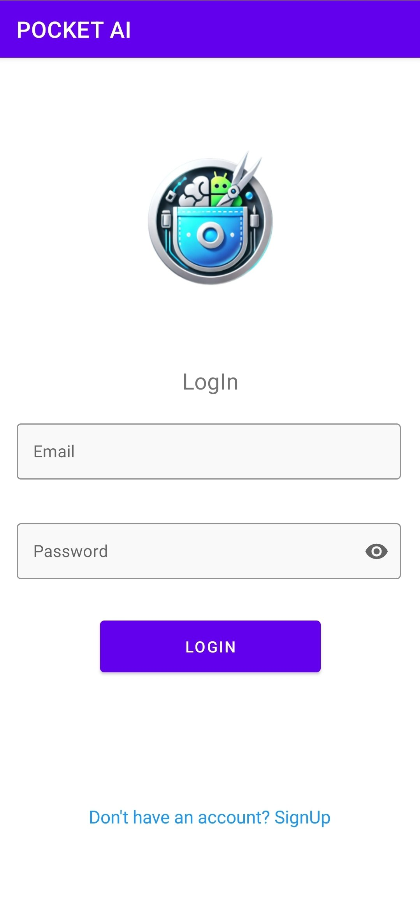
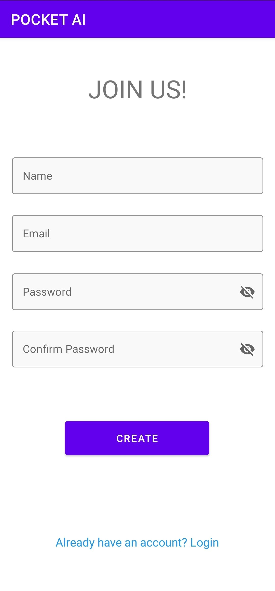
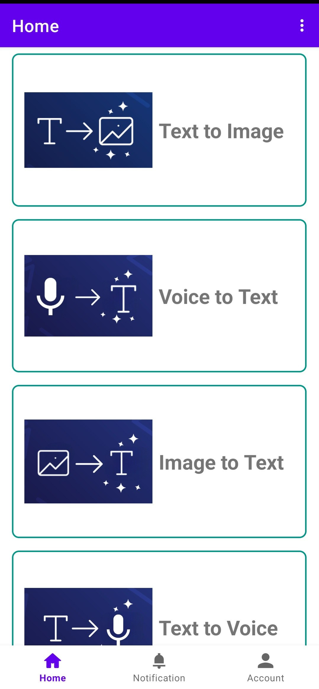
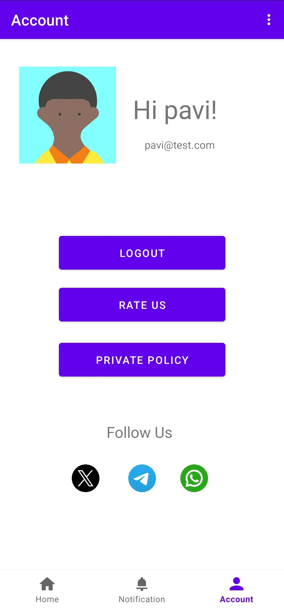
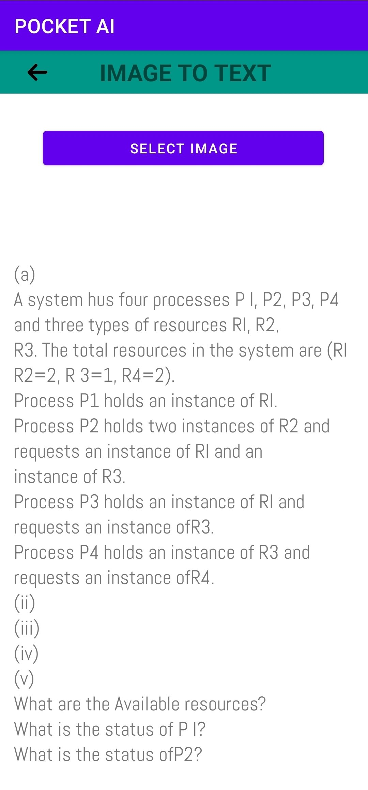
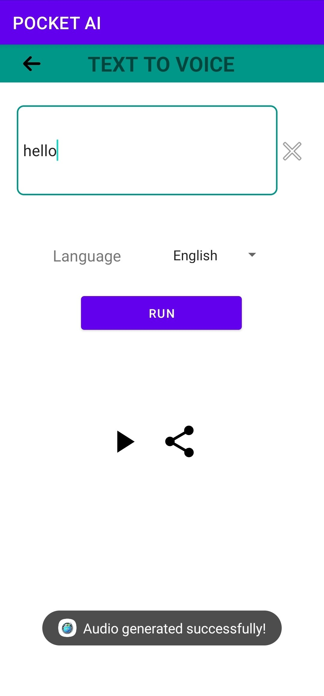
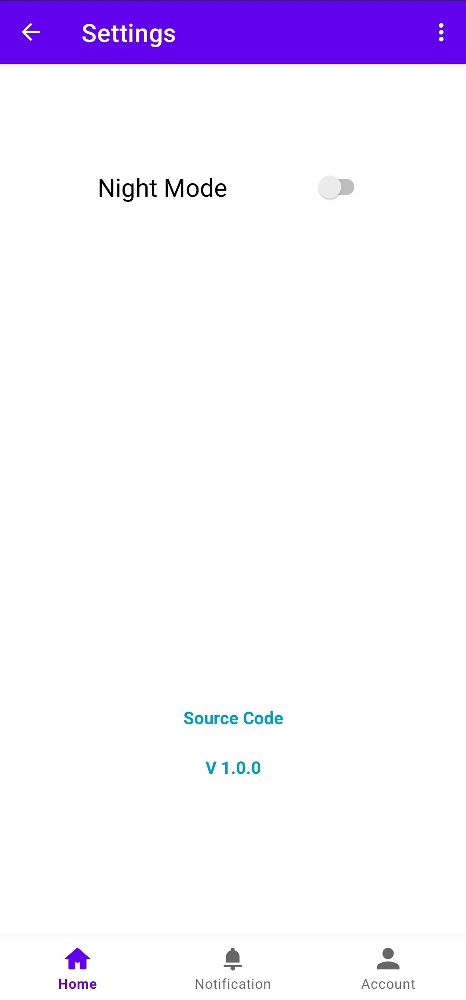

# PocketAi
It is a simple mobile application that offers basic AI tools to demonstrate Android programming principles and database,api integration

## Preview
*Demo Apk:* https://github.com/rekcah-pavi/PocketAi/releases/download/v1.0.0/app-release.apk

<table>
  <tr>
    <td></td>
    <td></td>
  </tr>
  <tr>
    <td></td>
    <td></td>
  </tr>
  <tr>
    <td></td>
    <td></td>
  </tr>
  <tr>
    <td></td>
    <td></td>
  </tr>
</table>

